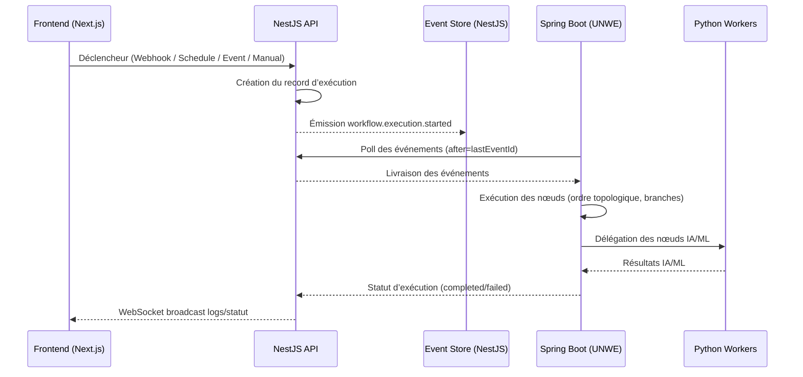

# Module Workflow — Spécification & Workflow

> **Dernière mise à jour:** 2026-01-21 | **Version:** 1.1 | **Statut:** DOCUMENTATION
>
> Comparables: n8n, Zapier, Make (Integromat), Pipedream, Temporal, Apache Airflow
>
> Inclus: Visual Workflow Builder, Triggers événementiels, Orchestration multi‑services, Moteur d’exécution

---

## Objectifs et portée du module

- Permettre la création, l’exécution et le suivi de workflows automatisés connectant services externes et modules internes ZodBack.
- Fournir un builder visuel (React Flow) avec configuration de nœuds, tests, et autosave.
- Orchestrer l’exécution via événements: NestJS (CRUD/événements), Spring Boot (moteur), Python (IA/transformations).
- Assurer observabilité complète: logs par nœud, métriques, analytics.
- Garantir sécurité et multi‑tenant: `projectId` obligatoire, tokens internes, RLS.

---

## Conditions préalables et dépendances

- Services actifs et accessibles:
  - Backend NestJS: `backend/src/workflows/` (CRUD, triggers, API, Event Store)
  - Spring Boot UNWE: `spring-services/src/main/java/com/zodback/spring/workflow/` (moteur, scheduling Quartz)
  - Python Workers: `python-services/python_services/apps/workflow/` (IA/ML, transformations, Celery)
  - Redis (queue/cache) et PostgreSQL (core + spring)
- Variables d’environnement et tokens internes configurés (headers: `Authorization`, `X-Project-Id`, `X-Request-Id`).
- Frontend Next.js: `frontend/app/(dashboard)/workflows/` pour builder et monitoring.

---

## Diagramme de séquence des processus



---

## Étapes détaillées d’exécution

1. Un trigger active un workflow (webhook, cron, événement, manuel).
2. NestJS enregistre l’exécution et émet `workflow.execution.started`.
3. Spring Boot consomme l’événement via polling et initialise le contexte.
4. Le moteur exécute les nœuds: topologie, if/switch, boucles, sous‑workflows.
5. Les nœuds IA/ML sont délégués aux workers Python via Celery.
6. Les progrès et logs sont émis (par nœud) et corrélés par `eventId`.
7. À la fin, Spring Boot publie le statut et NestJS diffuse au frontend.

---

## Gestion des erreurs et cas particuliers

- Catégories d’erreurs:
  - Transitoire (réseau/timeout): retry avec backoff exponentiel.
  - Validation (entrée invalide): pas de retry, journaliser et notifier.
  - Authentification: pas de retry, alerter.
  - Rate limit: retry avec délai adapté.
  - Inconnue: retry prudent, capture détaillée.
- Cas particuliers:
  - Boucles et branches: protéger contre cycles; limite d’itération.
  - Sous‑workflows: propager `projectId` et corrélation.
  - Annulation: état `cancelled`, cleanup de contexte.
  - Timeouts: par nœud et global; reprise idempotente possible.

---

## Exemples d’utilisation concrète

- Publication Blog → Slack + Notion:
  - Trigger `content.published` → message Slack → mise à jour page Notion.
- Paiement réussi → Email + Analytics:
  - `payment.transaction.succeeded` → email reçu (Thymeleaf) → appel Python analytics.
- Social Media → Planification:
  - Webhook entrée → transformer données → planifier post Twitter/LinkedIn.

---

## Localisation & Références

- Document: `.agent/$_prompt/Module_Workflow.md` ([Module_Workflow.md](file:///c:/Users/kevin/Allproject/zodback/.agent/$_prompt/Module_Workflow.md))
- Backend: `backend/src/workflows/` (CRUD, API, événements)
- Spring Boot: `spring-services/src/main/java/com/zodback/spring/workflow/`
- Python: `python-services/python_services/apps/workflow/`
- Frontend: `frontend/app/(dashboard)/workflows/`

---
 
# Workflow Automation System - Architecture Summary

## Implementation Status Overview

| Component | Status | Progress |
|-----------|--------|----------|
| Backend Core (CRUD) | :red_circle: NOT STARTED | 0% |
| Database Schema (Core) | :red_circle: NOT STARTED | 0/18 tables |
| Visual Workflow Builder | :red_circle: NOT STARTED | 0% |
| Execution Engine (Spring Boot) | :red_circle: NOT STARTED | 0% |
| Trigger System | :red_circle: NOT STARTED | 0% |
| Node Library | :red_circle: NOT STARTED | 0/50 nodes |
| Dashboard (Frontend) | :red_circle: NOT STARTED | 0/12 pages |
| Monitoring & Logs | :red_circle: NOT STARTED | 0% |
| Analytics Module | :red_circle: NOT STARTED | 0% |
| Python Workers (AI/ML) | :red_circle: NOT STARTED | 0% |
| Events & Notifications | :red_circle: NOT STARTED | 0% |
| API & Webhooks | :red_circle: NOT STARTED | 0% |

---

## Objective

Complete workflow automation platform enabling users to create, execute, and monitor automated workflows connecting multiple services, APIs, and internal ZodBack modules. Features include:
- **Visual drag-and-drop workflow builder** (like n8n)
- **Event-driven triggers** (webhooks, schedules, database changes, API events)
- **Extensive node library** (HTTP, databases, APIs, transformations, logic)
- **Multi-service orchestration** across NestJS, Spring Boot, and Python
- **Real-time execution monitoring** with detailed logs
- **Error handling & retry logic** with exponential backoff
- **Version control** for workflows
- **Team collaboration** with permissions

**Architecture:** Triple-layer system leveraging all backend services:
- **NestJS:** Workflow CRUD, API endpoints, event emission, trigger management
- **Spring Boot:** Execution engine, job scheduling (Quartz), retry logic, heavy processing
- **Python:** AI/ML nodes, data transformation, analytics, report generation

---

## Feature Inspiration (Industry Leaders)

> Reference: Features inspired by n8n, Zapier, Make, Pipedream, Temporal, Apache Airflow

| Feature | n8n | Zapier | Make | Pipedream | Temporal | Airflow |
|---------|:---:|:------:|:----:|:---------:|:--------:|:-------:|
| **Visual Builder** | :white_check_mark: | :white_check_mark: | :white_check_mark: | :white_check_mark: | :x: | :x: |
| **Self-Hosted** | :white_check_mark: | :x: | :x: | :white_check_mark: | :white_check_mark: | :white_check_mark: |
| **Code Nodes** | :white_check_mark: | :x: | :white_check_mark: | :white_check_mark: | :white_check_mark: | :white_check_mark: |
| **Branching/Logic** | :white_check_mark: | :white_check_mark: | :white_check_mark: | :white_check_mark: | :white_check_mark: | :white_check_mark: |
| **Error Handling** | :white_check_mark: | :white_check_mark: | :white_check_mark: | :white_check_mark: | :white_check_mark: | :white_check_mark: |
| **Webhooks** | :white_check_mark: | :white_check_mark: | :white_check_mark: | :white_check_mark: | :white_check_mark: | :x: |
| **Cron/Schedule** | :white_check_mark: | :white_check_mark: | :white_check_mark: | :white_check_mark: | :white_check_mark: | :white_check_mark: |
| **Real-time Logs** | :white_check_mark: | :x: | :white_check_mark: | :white_check_mark: | :white_check_mark: | :white_check_mark: |
| **Version Control** | :white_check_mark: | :x: | :x: | :white_check_mark: | :white_check_mark: | :white_check_mark: |
| **AI Nodes** | :white_check_mark: | :white_check_mark: | :white_check_mark: | :white_check_mark: | :x: | :x: |
| **400+ Integrations** | :white_check_mark: | :white_check_mark: | :white_check_mark: | :white_check_mark: | :x: | :x: |

---

## System Architecture

### Technology Distribution

```
┌──────────────────────────────────────────────────────────────────┐
│                    Next.js Frontend (Port 3014)                  │
│     Visual Workflow Builder | Execution Monitor | Analytics      │
└──────────────────────────────┬───────────────────────────────────┘
                               │ REST API + WebSocket
                               ▼
┌──────────────────────────────────────────────────────────────────┐
│              NestJS Core Gateway (Port 3013)                     │
│  ├─ Workflow CRUD & Version Control                              │
│  ├─ Trigger Management (Webhook, Schedule, Event)                │
│  ├─ Node Registry & Configuration                                │
│  ├─ Execution History & Logs                                     │
│  └─ Event Emission to Spring Boot                                │
└──────────────────────────────┬───────────────────────────────────┘
                               │ Events + Internal API
          ┌────────────────────┼────────────────────┐
          ▼                    ▼                    ▼
┌─────────────────┐  ┌─────────────────┐  ┌─────────────────┐
│  Spring Boot    │  │     Python      │  │     Redis       │
│  (Port 3020)    │  │   (Port 8012)   │  │  Queue/Cache    │
│                 │  │                 │  │                 │
│ • Execution     │  │ • AI/ML Nodes   │  │ • Job Queue     │
│   Engine        │  │ • Data Transform│  │ • State Store   │
│ • Quartz Jobs   │  │ • Analytics     │  │ • Pub/Sub       │
│ • Retry Logic   │  │ • Code Exec     │  │ • Rate Limiting │
│ • Heavy Tasks   │  │ • Celery Workers│  │                 │
└─────────────────┘  └─────────────────┘  └─────────────────┘
```

### Service Responsibilities

| Service | Responsibilities |
|---------|-----------------|
| **NestJS** | Workflow CRUD, Node Registry, Trigger Management, API Endpoints, Event Emission, Execution History |
| **Spring Boot** | Workflow Execution Engine, Quartz Scheduling, Retry Logic, Heavy Node Processing, WebSocket Broadcast |
| **Python** | AI/ML Nodes (GPT, Claude), Data Transformation, Code Execution (sandboxed), Report Generation |
| **Redis** | Job Queue, Execution State, Rate Limiting, Pub/Sub for Real-time Updates, Caching |

---

## Layer A: Dashboard & Visual Builder

**Location:** `frontend/app/(dashboard)/workflows/`
**Tech:** Next.js, React Flow (for visual builder), React Query, TypeScript

### Dashboard Pages (12 pages)

| Page | Route | Description | Status |
|------|-------|-------------|--------|
| Overview | `/workflows` | Dashboard overview, recent executions, stats | :red_circle: TODO |
| Workflows | `/workflows/list` | All workflows with filters | :red_circle: TODO |
| Builder | `/workflows/builder/[id]` | Visual workflow editor (React Flow) | :red_circle: TODO |
| Executions | `/workflows/executions` | Execution history with logs | :red_circle: TODO |
| Execution Detail | `/workflows/executions/[id]` | Single execution with node-by-node logs | :red_circle: TODO |
| Triggers | `/workflows/triggers` | Manage triggers (webhooks, schedules) | :red_circle: TODO |
| Nodes | `/workflows/nodes` | Node library browser | :red_circle: TODO |
| Credentials | `/workflows/credentials` | Manage API credentials | :red_circle: TODO |
| Templates | `/workflows/templates` | Workflow templates marketplace | :red_circle: TODO |
| Analytics | `/workflows/analytics` | Execution analytics, performance | :red_circle: TODO |
| Settings | `/workflows/settings` | Global workflow settings | :red_circle: TODO |
| API Setup | `/workflows/api` | Webhook URLs, API tokens | :red_circle: TODO |

### Visual Workflow Builder Features

**Canvas (React Flow):**
- Drag-and-drop nodes from library
- Visual connections between nodes (edges)
- Zoom, pan, minimap navigation
- Node grouping (sub-workflows)
- Real-time validation
- Auto-save (every 30s)
- Undo/redo history

**Node Configuration Panel:**
- Dynamic form based on node schema
- Input/output mapping
- Expression editor (JavaScript)
- Test node execution
- Documentation inline

**Execution Preview:**
- Dry-run mode (test without side effects)
- Step-by-step debugging
- Variable inspection
- Error simulation

---

## Layer B: Execution Engine (Spring Boot)

**Location:** `spring-services/src/main/java/com/zodback/spring/workflow/`
**Tech:** Spring Boot, Quartz Scheduler, Redis, WebFlux

### Execution Flow

```
1. Trigger fires (Webhook/Schedule/Event)
   ↓
2. NestJS creates execution record
   ↓
3. Event emitted: workflow.execution.started
   ↓
4. Spring Boot polls event
   ↓
5. Execution Engine processes workflow:
   - Fetch workflow definition
   - Initialize execution context
   - Execute nodes in topological order
   - Handle branching (IF/Switch)
   - Emit progress events
   ↓
6. For AI/ML nodes → Delegate to Python
   ↓
7. On completion → workflow.execution.completed
   ↓
8. WebSocket broadcast to frontend
```

### Node Executor Architecture

```java
public interface NodeExecutor {
    String getNodeType();
    NodeResult execute(NodeContext context);
    NodeSchema getSchema();
}

// Examples:
HttpRequestExecutor, DatabaseQueryExecutor,
TransformExecutor, IfConditionExecutor,
LoopExecutor, AiChatExecutor, CodeExecutor
```

### Retry & Error Handling

```java
@Configuration
public class RetryConfig {
    // Exponential backoff: 1s, 2s, 4s, 8s, 16s
    int[] delays = {1000, 2000, 4000, 8000, 16000};
    int maxRetries = 5;

    // Error categories
    enum ErrorCategory {
        TRANSIENT,    // Network, timeout → retry
        VALIDATION,   // Bad input → no retry
        AUTH,         // Auth failed → no retry, notify
        RATE_LIMIT,   // Too many requests → retry with delay
        UNKNOWN       // Unknown → retry with caution
    }
}
```

---

## Layer C: Python Workers (AI/ML)

**Location:** `python-services/python_services/apps/workflow/`
**Tech:** FastAPI, Celery, LangChain, OpenAI/Anthropic SDK

### AI/ML Node Types

| Node | Description | Tech |
|------|-------------|------|
| `ai.chat` | Chat completion (GPT-4, Claude) | OpenAI/Anthropic SDK |
| `ai.embedding` | Text embeddings | OpenAI/Voyage |
| `ai.image` | Image generation (DALL-E, Stable Diffusion) | Replicate/OpenAI |
| `ai.transcribe` | Audio transcription | Whisper |
| `ai.summarize` | Text summarization | LangChain |
| `ai.classify` | Text classification | HuggingFace |
| `ai.extract` | Entity extraction | LangChain |
| `ai.translate` | Multi-language translation | DeepL/OpenAI |
| `code.python` | Execute Python code (sandboxed) | RestrictedPython |
| `data.transform` | Complex data transformations | Pandas |
| `data.aggregate` | Data aggregation | Pandas/NumPy |

### Celery Task Queue

```python
@celery_app.task(name="workflow.execute_ai_node")
def execute_ai_node(node_type: str, params: dict, context: dict) -> dict:
    executor = get_node_executor(node_type)
    return executor.execute(params, context)

@celery_app.task(name="workflow.execute_code")
def execute_code(code: str, inputs: dict) -> dict:
    # Sandboxed Python execution
    return sandbox.execute(code, inputs, timeout=30)
```

---

## Backend API (NestJS)

**Location:** `backend/src/workflows/`
**Tech:** NestJS, Drizzle ORM, PostgreSQL

### Module Structure

```
workflows/
├── workflows.module.ts
├── controllers/
│   ├── workflows.controller.ts
│   ├── executions.controller.ts
│   ├── triggers.controller.ts
│   ├── nodes.controller.ts
│   ├── credentials.controller.ts
│   └── webhooks.controller.ts
├── services/
│   ├── workflows.service.ts
│   ├── executions.service.ts
│   ├── triggers.service.ts
│   ├── nodes.service.ts
│   ├── credentials.service.ts
│   └── expression.service.ts
├── dto/
│   ├── workflow.dto.ts
│   ├── execution.dto.ts
│   ├── trigger.dto.ts
│   └── node.dto.ts
└── events/
    └── workflow-events.helper.ts
```

### API Endpoints

**Base:** `/api/workflows/v1`
**Auth:** `@UseGuards(JwtGuard)` + Project Context

#### Workflows CRUD

| Method | Endpoint | Description |
|--------|----------|-------------|
| GET | `/` | List workflows |
| GET | `/:id` | Get workflow with definition |
| POST | `/` | Create workflow |
| PUT | `/:id` | Update workflow |
| DELETE | `/:id` | Delete workflow |
| POST | `/:id/duplicate` | Duplicate workflow |
| POST | `/:id/publish` | Publish workflow version |
| GET | `/:id/versions` | Get version history |
| POST | `/:id/versions/:versionId/restore` | Restore version |

#### Executions

| Method | Endpoint | Description |
|--------|----------|-------------|
| GET | `/executions` | List executions |
| GET | `/executions/:id` | Get execution with logs |
| POST | `/:id/execute` | Manual execution |
| POST | `/executions/:id/retry` | Retry failed execution |
| DELETE | `/executions/:id/cancel` | Cancel running execution |
| GET | `/executions/:id/logs` | Get node-by-node logs |

#### Triggers

| Method | Endpoint | Description |
|--------|----------|-------------|
| GET | `/triggers` | List triggers |
| POST | `/triggers` | Create trigger |
| PUT | `/triggers/:id` | Update trigger |
| DELETE | `/triggers/:id` | Delete trigger |
| POST | `/triggers/:id/activate` | Activate trigger |
| POST | `/triggers/:id/deactivate` | Deactivate trigger |

#### Webhooks (Public)

| Method | Endpoint | Description |
|--------|----------|-------------|
| POST | `/webhooks/:webhookId` | Webhook receiver (no auth) |
| GET | `/webhooks/:webhookId` | Webhook receiver (GET) |

#### Credentials

| Method | Endpoint | Description |
|--------|----------|-------------|
| GET | `/credentials` | List credentials |
| POST | `/credentials` | Create credential |
| PUT | `/credentials/:id` | Update credential |
| DELETE | `/credentials/:id` | Delete credential |
| POST | `/credentials/:id/test` | Test credential |

---

## Database Schema

### Core Tables (18 tables)

#### workflows
```sql
CREATE TABLE workflows (
  id SERIAL PRIMARY KEY,
  project_id INTEGER NOT NULL REFERENCES projects(id) ON DELETE CASCADE,
  user_id INTEGER NOT NULL REFERENCES users(id),
  name VARCHAR(255) NOT NULL,
  slug VARCHAR(255) NOT NULL,
  description TEXT,
  definition JSONB NOT NULL DEFAULT '{"nodes": [], "edges": [], "settings": {}}',
  status VARCHAR(20) NOT NULL DEFAULT 'draft' CHECK (status IN ('draft', 'active', 'paused', 'archived')),
  version INTEGER NOT NULL DEFAULT 1,
  published_version INTEGER,
  settings JSONB DEFAULT '{}',
  tags TEXT[],
  folder_id INTEGER REFERENCES workflow_folders(id),
  last_executed_at TIMESTAMP,
  execution_count INTEGER DEFAULT 0,
  success_count INTEGER DEFAULT 0,
  failure_count INTEGER DEFAULT 0,
  created_at TIMESTAMP DEFAULT NOW(),
  updated_at TIMESTAMP DEFAULT NOW(),
  UNIQUE(project_id, slug)
);

CREATE INDEX idx_workflows_project_id ON workflows(project_id);
CREATE INDEX idx_workflows_status ON workflows(status);
CREATE INDEX idx_workflows_tags ON workflows USING GIN(tags);

ALTER TABLE workflows ENABLE ROW LEVEL SECURITY;
CREATE POLICY project_isolation ON workflows
  USING (project_id = current_setting('app.project_id', true)::INTEGER);
```

#### workflow_versions
```sql
CREATE TABLE workflow_versions (
  id SERIAL PRIMARY KEY,
  workflow_id INTEGER NOT NULL REFERENCES workflows(id) ON DELETE CASCADE,
  version_number INTEGER NOT NULL,
  definition JSONB NOT NULL,
  changelog TEXT,
  published_at TIMESTAMP,
  user_id INTEGER NOT NULL REFERENCES users(id),
  created_at TIMESTAMP DEFAULT NOW(),
  UNIQUE(workflow_id, version_number)
);

CREATE INDEX idx_workflow_versions_workflow_id ON workflow_versions(workflow_id);
```

#### workflow_nodes
```sql
-- Node library/registry (system + custom)
CREATE TABLE workflow_nodes (
  id SERIAL PRIMARY KEY,
  project_id INTEGER REFERENCES projects(id), -- NULL for system nodes
  type VARCHAR(100) NOT NULL UNIQUE,
  name VARCHAR(255) NOT NULL,
  description TEXT,
  category VARCHAR(100) NOT NULL,
  icon VARCHAR(100),
  color VARCHAR(7),
  input_schema JSONB NOT NULL DEFAULT '{}',
  output_schema JSONB NOT NULL DEFAULT '{}',
  settings_schema JSONB NOT NULL DEFAULT '{}',
  documentation TEXT,
  is_system BOOLEAN DEFAULT FALSE,
  is_premium BOOLEAN DEFAULT FALSE,
  executor_service VARCHAR(20) DEFAULT 'spring' CHECK (executor_service IN ('spring', 'python', 'nestjs')),
  created_at TIMESTAMP DEFAULT NOW(),
  updated_at TIMESTAMP DEFAULT NOW()
);

CREATE INDEX idx_workflow_nodes_category ON workflow_nodes(category);
CREATE INDEX idx_workflow_nodes_type ON workflow_nodes(type);
```

#### workflow_triggers
```sql
CREATE TABLE workflow_triggers (
  id SERIAL PRIMARY KEY,
  workflow_id INTEGER NOT NULL REFERENCES workflows(id) ON DELETE CASCADE,
  project_id INTEGER NOT NULL REFERENCES projects(id) ON DELETE CASCADE,
  type VARCHAR(50) NOT NULL CHECK (type IN ('webhook', 'schedule', 'event', 'manual')),
  name VARCHAR(255) NOT NULL,
  configuration JSONB NOT NULL DEFAULT '{}',
  -- For webhooks
  webhook_id VARCHAR(64) UNIQUE,
  webhook_method VARCHAR(10) DEFAULT 'POST',
  -- For schedules
  cron_expression VARCHAR(100),
  timezone VARCHAR(50) DEFAULT 'UTC',
  -- For events
  event_name VARCHAR(255),
  event_filter JSONB,
  -- Status
  status VARCHAR(20) NOT NULL DEFAULT 'active' CHECK (status IN ('active', 'paused', 'error')),
  last_triggered_at TIMESTAMP,
  trigger_count INTEGER DEFAULT 0,
  error_message TEXT,
  created_at TIMESTAMP DEFAULT NOW(),
  updated_at TIMESTAMP DEFAULT NOW()
);

CREATE INDEX idx_workflow_triggers_workflow_id ON workflow_triggers(workflow_id);
CREATE INDEX idx_workflow_triggers_webhook_id ON workflow_triggers(webhook_id);
CREATE INDEX idx_workflow_triggers_event_name ON workflow_triggers(event_name);
CREATE INDEX idx_workflow_triggers_status ON workflow_triggers(status);

ALTER TABLE workflow_triggers ENABLE ROW LEVEL SECURITY;
CREATE POLICY project_isolation ON workflow_triggers
  USING (project_id = current_setting('app.project_id', true)::INTEGER);
```

#### workflow_executions
```sql
CREATE TABLE workflow_executions (
  id SERIAL PRIMARY KEY,
  workflow_id INTEGER NOT NULL REFERENCES workflows(id) ON DELETE CASCADE,
  project_id INTEGER NOT NULL REFERENCES projects(id) ON DELETE CASCADE,
  trigger_id INTEGER REFERENCES workflow_triggers(id),
  workflow_version INTEGER NOT NULL,
  status VARCHAR(20) NOT NULL DEFAULT 'pending' CHECK (status IN ('pending', 'running', 'completed', 'failed', 'cancelled', 'waiting')),
  trigger_type VARCHAR(50) NOT NULL,
  trigger_data JSONB,
  context JSONB DEFAULT '{}', -- Execution context/variables
  result JSONB,
  error_message TEXT,
  error_node_id VARCHAR(100),
  started_at TIMESTAMP,
  completed_at TIMESTAMP,
  duration_ms INTEGER,
  retry_count INTEGER DEFAULT 0,
  parent_execution_id INTEGER REFERENCES workflow_executions(id), -- For sub-workflows
  created_at TIMESTAMP DEFAULT NOW()
);

CREATE INDEX idx_workflow_executions_workflow_id ON workflow_executions(workflow_id);
CREATE INDEX idx_workflow_executions_status ON workflow_executions(status);
CREATE INDEX idx_workflow_executions_created_at ON workflow_executions(created_at);

ALTER TABLE workflow_executions ENABLE ROW LEVEL SECURITY;
CREATE POLICY project_isolation ON workflow_executions
  USING (project_id = current_setting('app.project_id', true)::INTEGER);
```

#### workflow_execution_logs
```sql
CREATE TABLE workflow_execution_logs (
  id SERIAL PRIMARY KEY,
  execution_id INTEGER NOT NULL REFERENCES workflow_executions(id) ON DELETE CASCADE,
  node_id VARCHAR(100) NOT NULL,
  node_type VARCHAR(100) NOT NULL,
  node_name VARCHAR(255),
  status VARCHAR(20) NOT NULL CHECK (status IN ('pending', 'running', 'completed', 'failed', 'skipped')),
  input_data JSONB,
  output_data JSONB,
  error_message TEXT,
  error_stack TEXT,
  started_at TIMESTAMP,
  completed_at TIMESTAMP,
  duration_ms INTEGER,
  retry_count INTEGER DEFAULT 0,
  created_at TIMESTAMP DEFAULT NOW()
);

CREATE INDEX idx_execution_logs_execution_id ON workflow_execution_logs(execution_id);
CREATE INDEX idx_execution_logs_node_id ON workflow_execution_logs(node_id);
CREATE INDEX idx_execution_logs_status ON workflow_execution_logs(status);
```

#### workflow_credentials
```sql
CREATE TABLE workflow_credentials (
  id SERIAL PRIMARY KEY,
  project_id INTEGER NOT NULL REFERENCES projects(id) ON DELETE CASCADE,
  user_id INTEGER NOT NULL REFERENCES users(id),
  name VARCHAR(255) NOT NULL,
  type VARCHAR(100) NOT NULL, -- 'oauth2', 'api_key', 'basic_auth', 'custom'
  service VARCHAR(100) NOT NULL, -- 'openai', 'stripe', 'slack', etc.
  data_encrypted TEXT NOT NULL, -- AES-256 encrypted JSON
  status VARCHAR(20) NOT NULL DEFAULT 'active' CHECK (status IN ('active', 'expired', 'error')),
  last_used_at TIMESTAMP,
  expires_at TIMESTAMP,
  created_at TIMESTAMP DEFAULT NOW(),
  updated_at TIMESTAMP DEFAULT NOW(),
  UNIQUE(project_id, name)
);

CREATE INDEX idx_workflow_credentials_project_id ON workflow_credentials(project_id);
CREATE INDEX idx_workflow_credentials_service ON workflow_credentials(service);

ALTER TABLE workflow_credentials ENABLE ROW LEVEL SECURITY;
CREATE POLICY project_isolation ON workflow_credentials
  USING (project_id = current_setting('app.project_id', true)::INTEGER);
```

#### workflow_folders
```sql
CREATE TABLE workflow_folders (
  id SERIAL PRIMARY KEY,
  project_id INTEGER NOT NULL REFERENCES projects(id) ON DELETE CASCADE,
  parent_id INTEGER REFERENCES workflow_folders(id),
  name VARCHAR(255) NOT NULL,
  color VARCHAR(7),
  icon VARCHAR(50),
  sort_order INTEGER DEFAULT 0,
  created_at TIMESTAMP DEFAULT NOW(),
  UNIQUE(project_id, parent_id, name)
);
```

#### workflow_templates
```sql
CREATE TABLE workflow_templates (
  id SERIAL PRIMARY KEY,
  project_id INTEGER REFERENCES projects(id), -- NULL for system templates
  name VARCHAR(255) NOT NULL,
  slug VARCHAR(255) NOT NULL UNIQUE,
  description TEXT,
  category VARCHAR(100),
  definition JSONB NOT NULL,
  icon VARCHAR(100),
  thumbnail_url TEXT,
  is_system BOOLEAN DEFAULT FALSE,
  is_premium BOOLEAN DEFAULT FALSE,
  use_count INTEGER DEFAULT 0,
  created_at TIMESTAMP DEFAULT NOW()
);
```

#### workflow_variables
```sql
-- Global variables per project
CREATE TABLE workflow_variables (
  id SERIAL PRIMARY KEY,
  project_id INTEGER NOT NULL REFERENCES projects(id) ON DELETE CASCADE,
  key VARCHAR(255) NOT NULL,
  value TEXT,
  is_secret BOOLEAN DEFAULT FALSE,
  description TEXT,
  created_at TIMESTAMP DEFAULT NOW(),
  updated_at TIMESTAMP DEFAULT NOW(),
  UNIQUE(project_id, key)
);

ALTER TABLE workflow_variables ENABLE ROW LEVEL SECURITY;
CREATE POLICY project_isolation ON workflow_variables
  USING (project_id = current_setting('app.project_id', true)::INTEGER);
```

#### workflow_analytics
```sql
CREATE TABLE workflow_analytics (
  id SERIAL PRIMARY KEY,
  workflow_id INTEGER NOT NULL REFERENCES workflows(id) ON DELETE CASCADE,
  project_id INTEGER NOT NULL REFERENCES projects(id) ON DELETE CASCADE,
  date DATE NOT NULL,
  executions INTEGER DEFAULT 0,
  successes INTEGER DEFAULT 0,
  failures INTEGER DEFAULT 0,
  avg_duration_ms INTEGER,
  total_duration_ms BIGINT,
  nodes_executed INTEGER DEFAULT 0,
  created_at TIMESTAMP DEFAULT NOW(),
  UNIQUE(workflow_id, date)
);

CREATE INDEX idx_workflow_analytics_date ON workflow_analytics(date);
```

### Spring Boot Tables (zodback_spring)

#### workflow_jobs
```sql
CREATE TABLE workflow_jobs (
  id SERIAL PRIMARY KEY,
  project_id INTEGER NOT NULL,
  execution_id INTEGER NOT NULL,
  workflow_id INTEGER NOT NULL,
  status VARCHAR(20) NOT NULL DEFAULT 'PENDING' CHECK (status IN ('PENDING', 'IN_PROGRESS', 'COMPLETED', 'FAILED', 'CANCELLED')),
  current_node_id VARCHAR(100),
  progress INTEGER DEFAULT 0, -- 0-100
  retry_count INTEGER DEFAULT 0,
  max_retries INTEGER DEFAULT 3,
  next_retry_at TIMESTAMP,
  error_message TEXT,
  error_category VARCHAR(50),
  started_at TIMESTAMP,
  completed_at TIMESTAMP,
  created_at TIMESTAMP DEFAULT NOW(),
  updated_at TIMESTAMP DEFAULT NOW()
);

CREATE INDEX idx_workflow_jobs_status ON workflow_jobs(status);
CREATE INDEX idx_workflow_jobs_execution_id ON workflow_jobs(execution_id);

ALTER TABLE workflow_jobs ENABLE ROW LEVEL SECURITY;
CREATE POLICY project_isolation ON workflow_jobs
  USING (project_id = current_setting('app.project_id', true)::INTEGER);
```

#### workflow_scheduled_triggers
```sql
CREATE TABLE workflow_scheduled_triggers (
  id SERIAL PRIMARY KEY,
  project_id INTEGER NOT NULL,
  trigger_id INTEGER NOT NULL,
  workflow_id INTEGER NOT NULL,
  cron_expression VARCHAR(100) NOT NULL,
  timezone VARCHAR(50) DEFAULT 'UTC',
  next_fire_at TIMESTAMP NOT NULL,
  last_fired_at TIMESTAMP,
  status VARCHAR(20) NOT NULL DEFAULT 'ACTIVE' CHECK (status IN ('ACTIVE', 'PAUSED', 'DELETED')),
  quartz_job_key VARCHAR(255),
  created_at TIMESTAMP DEFAULT NOW(),
  updated_at TIMESTAMP DEFAULT NOW()
);

CREATE INDEX idx_scheduled_triggers_next_fire ON workflow_scheduled_triggers(next_fire_at);
CREATE INDEX idx_scheduled_triggers_status ON workflow_scheduled_triggers(status);
```

---

## Node Library (50+ Nodes)

### Core Nodes

| Category | Node Type | Description | Executor |
|----------|-----------|-------------|----------|
| **Trigger** | `trigger.webhook` | HTTP webhook receiver | NestJS |
| | `trigger.schedule` | Cron-based trigger | Spring Boot |
| | `trigger.event` | ZodBack event listener | NestJS |
| | `trigger.manual` | Manual execution | NestJS |
| **Flow Control** | `flow.if` | Conditional branching | Spring Boot |
| | `flow.switch` | Multi-path branching | Spring Boot |
| | `flow.merge` | Merge multiple branches | Spring Boot |
| | `flow.loop` | Loop over items | Spring Boot |
| | `flow.wait` | Wait for condition/time | Spring Boot |
| | `flow.error` | Error handler | Spring Boot |
| | `flow.subworkflow` | Execute another workflow | Spring Boot |
| **HTTP** | `http.request` | HTTP request | Spring Boot |
| | `http.response` | Webhook response | Spring Boot |
| | `http.graphql` | GraphQL request | Spring Boot |
| **Data** | `data.transform` | JavaScript transformation | Spring Boot |
| | `data.set` | Set variable | Spring Boot |
| | `data.filter` | Filter array items | Spring Boot |
| | `data.aggregate` | Aggregate data | Python |
| | `data.split` | Split into multiple items | Spring Boot |
| | `data.merge` | Merge data | Spring Boot |
| | `data.code` | Custom Python code | Python |
| **Database** | `db.postgres` | PostgreSQL query | Spring Boot |
| | `db.mysql` | MySQL query | Spring Boot |
| | `db.mongodb` | MongoDB query | Spring Boot |
| | `db.redis` | Redis operations | Spring Boot |
| **Files** | `file.read` | Read file | Spring Boot |
| | `file.write` | Write file | Spring Boot |
| | `file.csv` | Parse/generate CSV | Spring Boot |
| | `file.json` | Parse/generate JSON | Spring Boot |
| | `file.s3` | S3 operations | Spring Boot |

### Integration Nodes

| Category | Node Type | Description | Executor |
|----------|-----------|-------------|----------|
| **Communication** | `email.send` | Send email (SMTP/SendGrid) | Spring Boot |
| | `slack.message` | Send Slack message | Spring Boot |
| | `discord.message` | Send Discord message | Spring Boot |
| | `telegram.message` | Send Telegram message | Spring Boot |
| | `sms.send` | Send SMS (Twilio) | Spring Boot |
| **CRM** | `hubspot.*` | HubSpot operations | Spring Boot |
| | `salesforce.*` | Salesforce operations | Spring Boot |
| | `pipedrive.*` | Pipedrive operations | Spring Boot |
| **Payments** | `stripe.*` | Stripe operations | Spring Boot |
| | `paypal.*` | PayPal operations | Spring Boot |
| **Social** | `twitter.*` | Twitter/X operations | Spring Boot |
| | `linkedin.*` | LinkedIn operations | Spring Boot |
| | `facebook.*` | Facebook operations | Spring Boot |
| **Productivity** | `notion.*` | Notion operations | Spring Boot |
| | `airtable.*` | Airtable operations | Spring Boot |
| | `google.sheets` | Google Sheets | Spring Boot |
| | `google.calendar` | Google Calendar | Spring Boot |
| | `google.drive` | Google Drive | Spring Boot |

### AI/ML Nodes

| Category | Node Type | Description | Executor |
|----------|-----------|-------------|----------|
| **AI Chat** | `ai.openai.chat` | OpenAI GPT completion | Python |
| | `ai.anthropic.chat` | Anthropic Claude completion | Python |
| | `ai.langchain.chain` | LangChain chain execution | Python |
| **AI Vision** | `ai.openai.vision` | GPT-4 Vision | Python |
| | `ai.image.generate` | DALL-E image generation | Python |
| **AI Audio** | `ai.whisper.transcribe` | Audio transcription | Python |
| | `ai.tts.generate` | Text-to-speech | Python |
| **AI Text** | `ai.summarize` | Text summarization | Python |
| | `ai.classify` | Text classification | Python |
| | `ai.extract` | Entity extraction | Python |
| | `ai.translate` | Translation | Python |
| | `ai.sentiment` | Sentiment analysis | Python |
| **AI Embeddings** | `ai.embedding.create` | Create embeddings | Python |
| | `ai.embedding.search` | Semantic search | Python |

### ZodBack Integration Nodes

| Category | Node Type | Description | Executor |
|----------|-----------|-------------|----------|
| **Internal** | `zodback.event.emit` | Emit ZodBack event | NestJS |
| | `zodback.event.wait` | Wait for ZodBack event | Spring Boot |
| | `zodback.api` | Call internal API | NestJS |
| | `zodback.user.get` | Get user data | NestJS |
| | `zodback.project.get` | Get project data | NestJS |
| **Blog** | `zodback.blog.post.create` | Create blog post | NestJS |
| | `zodback.blog.post.publish` | Publish blog post | NestJS |
| **E-Learning** | `zodback.course.enroll` | Enroll user in course | NestJS |
| | `zodback.certificate.issue` | Issue certificate | NestJS |
| **Social Media** | `zodback.social.post.schedule` | Schedule social post | NestJS |
| **Notifications** | `zodback.notification.send` | Send notification | NestJS |

---

## Domain Events

### Event Specification

```typescript
interface WorkflowEvent<T> extends DomainEvent<T> {
  name: string;
  eventId: string;
  source: 'nestjs-workflow';
  occurredAt: string; // ISO 8601
  projectId: string;
  payload: T;
}
```

### Event Catalog

---

## Inter-Service Communication

**Principles**
- NestJS is the gateway and authority; Spring Boot and Python are internal consumers.
- Events carry projectId and eventId for multi-tenant isolation and idempotence.
- Prefer Spring Boot PULL model; use PUSH only in development.

**Contracts**
- Spring Boot polls NestJS:
  - GET `/api/events/v1/poll?service=spring-unwe&after={lastEventId}&limit={limit}`
  - Headers: `Authorization: Bearer {NESTJS_INTERNAL_TOKEN}`
  - Response: JSON array of domain events sorted by occurrence
- NestJS forwards in dev (optional):
  - POST `{SPRING_EVENT_CONSUMER_URL}` with event JSON
  - Headers: `X-Project-Id`, `X-Request-Id`
- Python analytics:
  - POST `{PYTHON_INTERNAL_BASE_URL}/internal/analytics/recompute`
  - Headers: `Authorization: Bearer {PYTHON_INTERNAL_TOKEN}`, `X-Project-Id`, `X-Request-Id`
- Frontend calls NestJS:
  - Base URL `NEXT_PUBLIC_API_URL` (default `http://localhost:3013`)
  - Headers added automatically: `Authorization: Bearer <JWT>`, `x-project-id`

**Security Rules**
- Reject default dev tokens in production; require strong secrets.
- Validate `projectId` on all endpoints and events when `ENABLE_P3_STRICT=true`.
- Spring Boot never calls Python directly; it uses NestJS internal APIs.

---

## MVP Roadmap

**P0 – Foundations**
- NestJS: Workflow CRUD, triggers, event emission, execution history tables.
- Spring Boot: Poll consumer, minimal execution engine, WebSocket broadcast.
- Python: Stub analytics endpoint; Celery setup skeleton.
- Frontend: Workflows list, basic builder scaffold, executions list, logs viewer.

**P1 – Usability & Scale**
- Visual builder (React Flow), node config forms, draft autosave.
- Retry policies, error categories, backoff; idempotent execution.
- Credentials storage with encryption; templates marketplace.
- Queue-backed Python nodes (DLQ, retries) and monitoring.

**P2 – Enterprise**
- Multi-tenant hardening, RBAC, audit trails, SSO.
- Advanced nodes (CRM, payments, social, files) and rate limiting.
- Version control for workflows; publish/restore.

---

## Testing & Observability

- Unit: node executors, trigger parsing, expression evaluation.
- Integration: event emission → spring poll → execution logs.
- E2E: create workflow → trigger → execution → Python node.
- Metrics: events emitted/processed/failed, poll lag, execution duration.
- Logs: `event_processing_logs`, execution logs per node, correlation via `eventId`.

---

## Security & Compliance

- Enforce RLS on all workflow tables by `project_id`.
- Secret management for credentials; avoid logging secrets.
- Validate tokens and mandatory headers on internal endpoints.

#### Workflow Events

**workflow.created**
```typescript
{
  name: 'workflow.created',
  payload: {
    workflowId: number;
    userId: number;
    projectId: number;
    name: string;
    slug: string;
  }
}
```

**workflow.activated**
```typescript
{
  name: 'workflow.activated',
  payload: {
    workflowId: number;
    userId: number;
    triggerCount: number;
  }
}
```

**workflow.published**
```typescript
{
  name: 'workflow.published',
  payload: {
    workflowId: number;
    userId: number;
    version: number;
    changelog: string;
  }
}
```

#### Execution Events

**workflow.execution.started**
```typescript
{
  name: 'workflow.execution.started',
  payload: {
    executionId: number;
    workflowId: number;
    triggerId: number;
    triggerType: 'webhook' | 'schedule' | 'event' | 'manual';
    triggerData: any;
  }
}
```

**workflow.execution.node.started**
```typescript
{
  name: 'workflow.execution.node.started',
  payload: {
    executionId: number;
    nodeId: string;
    nodeType: string;
    nodeName: string;
  }
}
```

**workflow.execution.node.completed**
```typescript
{
  name: 'workflow.execution.node.completed',
  payload: {
    executionId: number;
    nodeId: string;
    nodeType: string;
    duration_ms: number;
    outputPreview: any; // Truncated output
  }
}
```

**workflow.execution.completed**
```typescript
{
  name: 'workflow.execution.completed',
  payload: {
    executionId: number;
    workflowId: number;
    status: 'completed' | 'failed';
    duration_ms: number;
    nodesExecuted: number;
    errorMessage?: string;
    errorNodeId?: string;
  }
}
```

#### Trigger Events

**workflow.trigger.fired**
```typescript
{
  name: 'workflow.trigger.fired',
  payload: {
    triggerId: number;
    workflowId: number;
    triggerType: string;
    executionId: number;
  }
}
```

**workflow.trigger.error**
```typescript
{
  name: 'workflow.trigger.error',
  payload: {
    triggerId: number;
    workflowId: number;
    errorMessage: string;
  }
}
```

### Event Flow Example

```
1. Webhook received → workflow.trigger.fired
2. NestJS creates execution → workflow.execution.started
3. Spring Boot polls and starts processing
4. For each node:
   - workflow.execution.node.started
   - Node executes
   - workflow.execution.node.completed
5. On completion → workflow.execution.completed
6. WebSocket broadcasts progress to frontend
7. Notification sent to user (if configured)
```

---

## Security Rules

### Credential Encryption

**Storage:**
- Credentials encrypted with AES-256-GCM
- Encryption key from environment: `WORKFLOW_ENCRYPTION_KEY`
- Never returned in API responses (only metadata)
- Decrypted only in-memory during execution

### Webhook Security

**Options:**
- Secret token validation (X-Webhook-Secret header)
- IP whitelist (optional)
- HMAC signature verification
- Request body validation

### Code Execution Sandboxing

**Python Code Node:**
- RestrictedPython for sandboxed execution
- No file system access
- No network access (except via HTTP node)
- Timeout: 30 seconds
- Memory limit: 256MB

### Multi-Tenancy

**RLS Policies:**
- All queries filtered by `project_id`
- Credentials isolated per project
- Executions only visible to project members
- Webhooks include project validation

---

## Performance Standards

| Metric | Target |
|--------|--------|
| Workflow save | < 500ms |
| Execution start latency | < 1s |
| Node execution (simple) | < 500ms |
| Node execution (HTTP) | < 5s |
| Node execution (AI) | < 30s |
| Builder load (100 nodes) | < 2s |
| Execution logs load | < 500ms |
| Real-time update latency | < 200ms |

### Optimizations

**Database:**
- Indexes on status, created_at, workflow_id
- Partitioning execution_logs by month
- Archive old executions (> 90 days)

**Execution:**
- Parallel node execution (when possible)
- Connection pooling for HTTP nodes
- Redis caching for credentials
- Batch database operations

**Frontend:**
- React Flow virtualization
- Lazy load node library
- Debounced auto-save
- WebSocket for real-time updates

---

## Environment Variables

### NestJS (.env)

```bash
# Workflow Module
WORKFLOW_ENCRYPTION_KEY=<32-byte hex string>
WORKFLOW_WEBHOOK_BASE_URL=https://api.yourdomain.com/api/workflows/v1/webhooks
WORKFLOW_MAX_EXECUTION_TIME_MS=300000
WORKFLOW_MAX_NODES_PER_WORKFLOW=200

# Spring Boot Integration
SPRING_WORKFLOW_URL=http://localhost:3020
SPRING_INTERNAL_TOKEN=<shared secret>

# Python Integration
PYTHON_WORKFLOW_URL=http://localhost:8012
PYTHON_INTERNAL_TOKEN=<shared secret>
```

### Spring Boot (application.properties)

```properties
# Database
spring.datasource.url=jdbc:postgresql://localhost:5432/zodback_spring
spring.datasource.username=zodback_spring
spring.datasource.password=

# NestJS Integration
zodback.nestjs.url=http://localhost:3013
zodback.nestjs.internal-token=<shared secret>

# Workflow Execution
zodback.workflow.execution.max-concurrent=50
zodback.workflow.execution.timeout-ms=300000
zodback.workflow.execution.retry-max=3

# Quartz
spring.quartz.job-store-type=jdbc
spring.quartz.properties.org.quartz.threadPool.threadCount=20
```

### Python (.env)

```bash
# Database
DATABASE_URL=postgresql://...

# Redis
REDIS_URL=redis://...

# AI Services
OPENAI_API_KEY=<key>
ANTHROPIC_API_KEY=<key>

# Internal Token
WORKFLOW_INTERNAL_TOKEN=<shared secret>

# Execution Limits
CODE_EXECUTION_TIMEOUT=30
CODE_EXECUTION_MEMORY_MB=256
```

---

## User Workflow (10-15 min)

### First Workflow Creation

1. **Navigate to Workflows** (30 sec)
   - Go to `/workflows`
   - Click "New Workflow"

2. **Design in Visual Builder** (5-7 min)
   - Drag trigger node (e.g., Webhook)
   - Add processing nodes (e.g., HTTP Request, Transform)
   - Add action nodes (e.g., Send Email)
   - Connect nodes with edges
   - Configure each node

3. **Add Credentials** (1-2 min)
   - Go to `/workflows/credentials`
   - Add API keys for services used
   - Test credentials

4. **Test Workflow** (1-2 min)
   - Click "Test" button
   - Provide test input data
   - Watch execution in real-time
   - Debug any errors

5. **Activate Workflow** (30 sec)
   - Click "Activate"
   - Workflow starts listening for triggers

### Monitoring (Ongoing)

- View executions at `/workflows/executions`
- Check analytics at `/workflows/analytics`
- Receive notifications on failures

---

## Success Criteria

### Functional Requirements

- User can create workflows with visual drag-and-drop builder
- User can configure 50+ node types
- User can set up triggers (webhook, schedule, event)
- User can test workflows before activation
- User can monitor executions in real-time
- User can view detailed logs per node
- User can manage credentials securely
- User can version and rollback workflows
- User can use templates for quick start
- User can set up error notifications

### Technical Requirements

- Multi-tenancy enforced via RLS
- Credentials encrypted at rest (AES-256)
- Webhook validation (secret/HMAC)
- Code execution sandboxed
- Retry logic with exponential backoff
- Event-driven architecture
- All services communicate via events
- Database migrations versioned
- All API endpoints versioned (`/v1`)

### Quality Requirements

- All endpoints respond < 1s
- Execution start latency < 1s
- Test coverage > 80%
- Zero data leaks between projects
- Graceful degradation
- Error messages user-friendly

---

## Implementation Checklist

### Phase 1: Foundation (P0 - MVP)

**Backend (NestJS):**
- [ ] Create `workflows` module structure
- [ ] Implement database schema (18 tables)
- [ ] Implement workflow CRUD endpoints
- [ ] Implement trigger management
- [ ] Implement webhook receiver
- [ ] Implement credential encryption
- [ ] Implement event emission helper
- [ ] Add Drizzle migrations

**Spring Boot:**
- [ ] Create `workflow` module
- [ ] Implement execution engine
- [ ] Implement Quartz jobs (schedule triggers)
- [ ] Implement core node executors (10 nodes)
- [ ] Implement retry logic
- [ ] Implement event polling
- [ ] Add Flyway migrations

**Frontend:**
- [ ] Create `/workflows` dashboard layout
- [ ] Implement React Flow visual builder
- [ ] Implement node library sidebar
- [ ] Implement node configuration panel
- [ ] Implement execution monitor
- [ ] Implement credentials management UI

**Testing:**
- [ ] Unit tests for node executors
- [ ] Integration tests for execution flow
- [ ] e2e test: Create → Activate → Trigger → Execute

---

### Phase 2: Advanced Features (P1)

**More Nodes:**
- [ ] Integration nodes (20 services)
- [ ] Database nodes (5 types)
- [ ] File nodes (S3, CSV, JSON)

**AI Nodes (Python):**
- [ ] OpenAI integration
- [ ] Anthropic integration
- [ ] Code execution sandbox

**Advanced Features:**
- [ ] Sub-workflows
- [ ] Version control
- [ ] Templates marketplace
- [ ] Team permissions
- [ ] Analytics dashboard

---

### Phase 3: Premium Features (P2)

- [ ] 50+ integration nodes
- [ ] Advanced AI nodes (vision, audio)
- [ ] Custom node builder
- [ ] API access for external tools
- [ ] White-label execution reports

---

## Appendix

### Glossary

- **Workflow:** Automated sequence of nodes connected by edges
- **Node:** Single step/action in a workflow
- **Edge:** Connection between nodes defining execution flow
- **Trigger:** Event that starts workflow execution
- **Execution:** Single run of a workflow
- **Credential:** Stored API key or authentication for external services

### References

- n8n Documentation: https://docs.n8n.io
- React Flow: https://reactflow.dev
- Quartz Scheduler: https://www.quartz-scheduler.org
- Temporal: https://temporal.io
- Make (Integromat): https://www.make.com

### Contributors

- Architecture: Kevin (Architect agent)
- Implementation: Development team
- Documentation: Claude Code

---

**Last Updated:** 2026-01-21
**Version:** 1.0
**Status:** SPECIFICATION - Ready for Implementation
