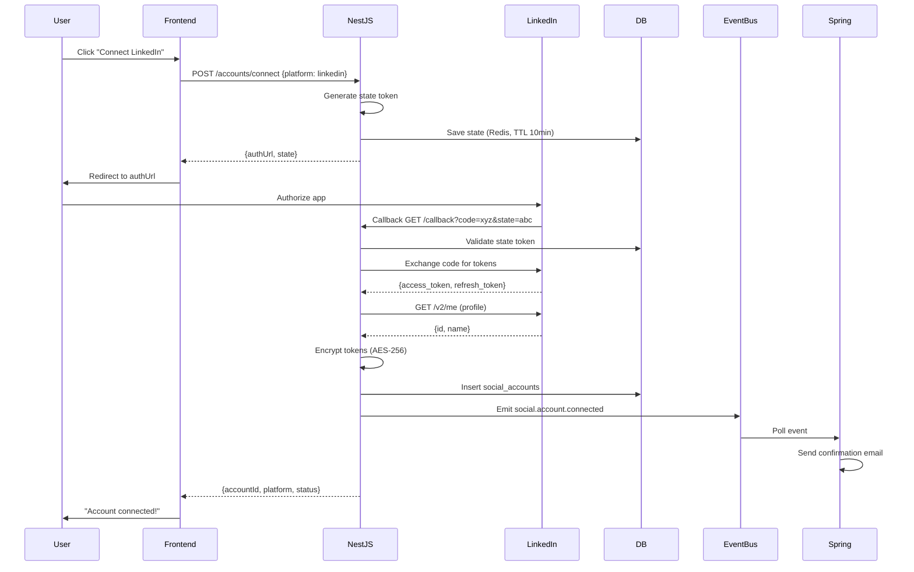
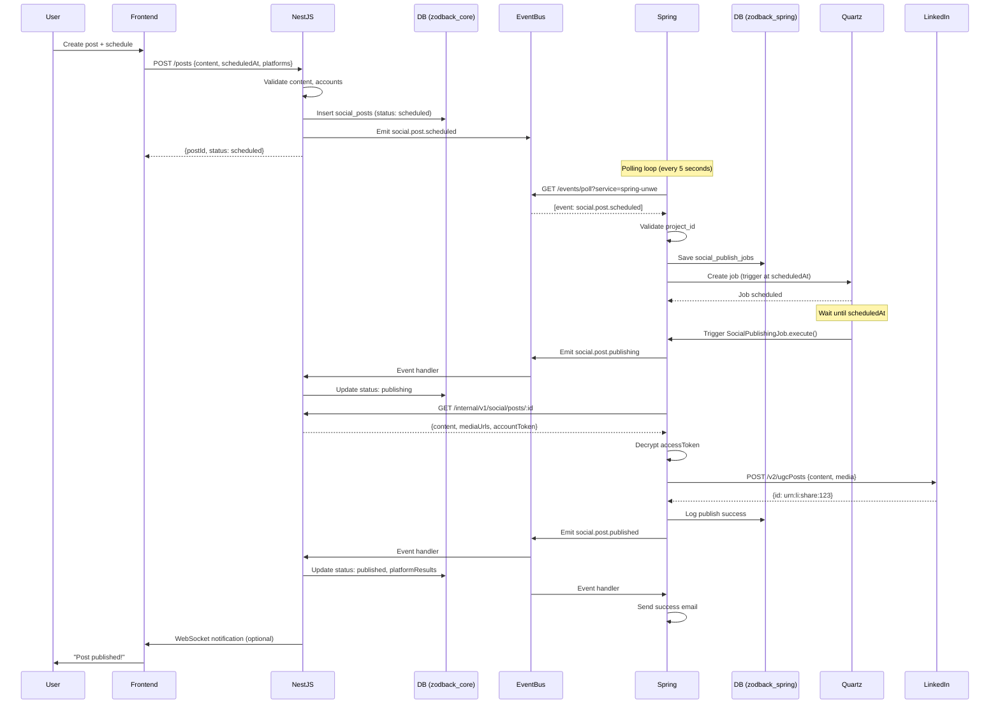
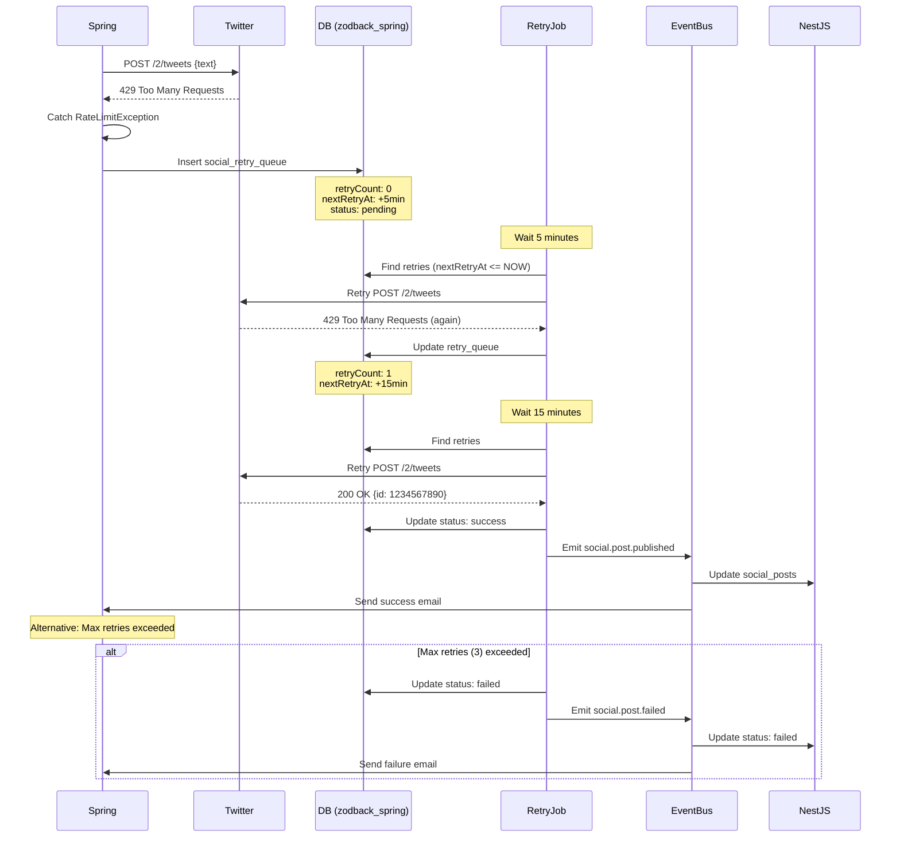
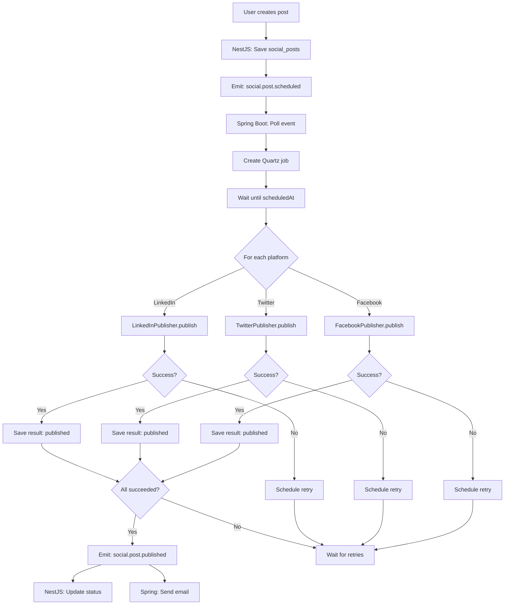
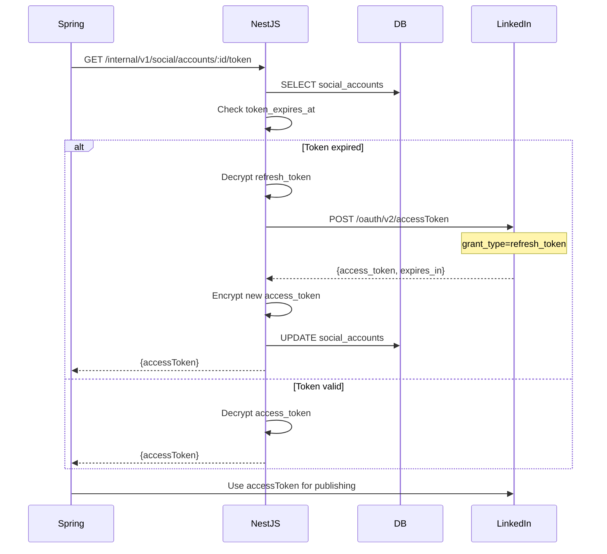
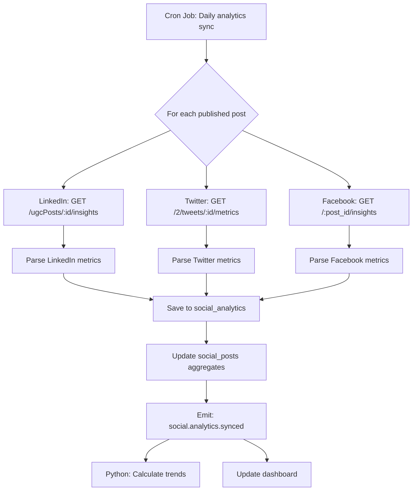
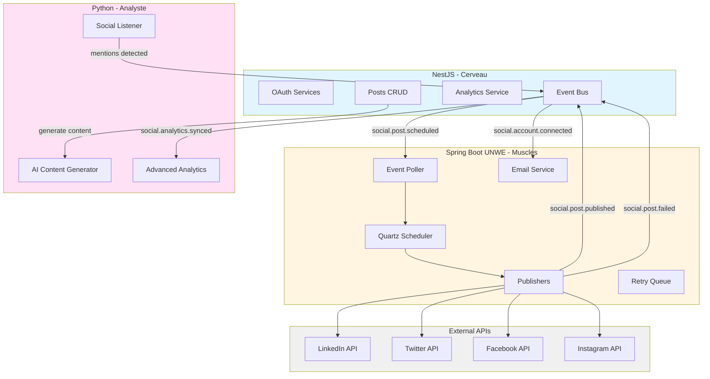
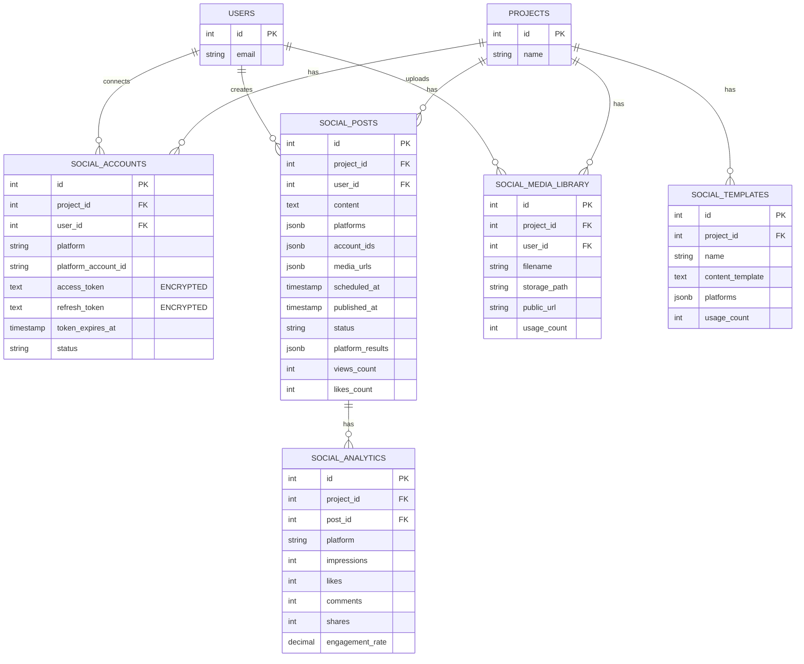
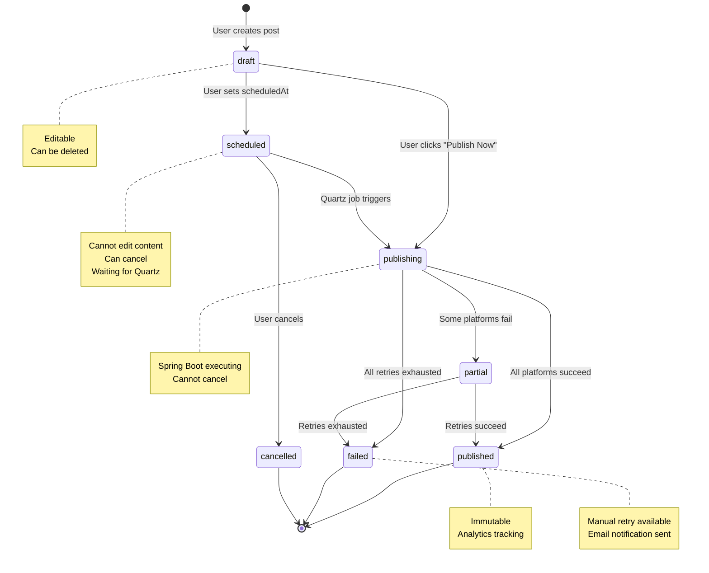
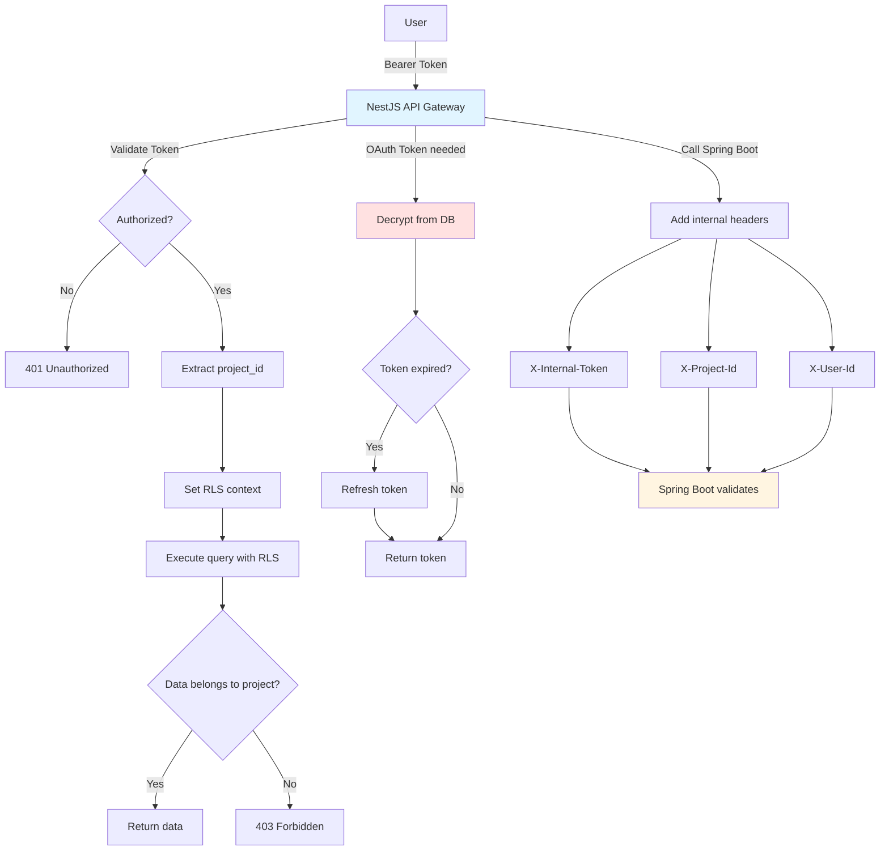

# Social Media Management - Technical Diagrams

## 1. OAuth Flow (LinkedIn)

---

## 2. Scheduled Post Publication Flow

---

## 3. Retry Flow (Rate Limit Exceeded)

---

## 4. Multi-Platform Publishing

---

## 5. Token Refresh Flow

---

## 6. Analytics Sync Flow

---

## 7. Event-Driven Architecture

---

## 8. Database Relationships

---

## 9. State Machine (Post Status)

---

## 10. Security Architecture

---

## Notes

- All diagrams use standard architectural patterns
- Event-driven flows ensure loose coupling
- RLS guarantees multi-tenancy isolation
- Token encryption prevents credential leaks
- Retry logic handles transient failures
- State machine prevents invalid transitions

**Location:** `.agent/ai-memory/$_tasks/task_004_social_media_diagrams.md`
