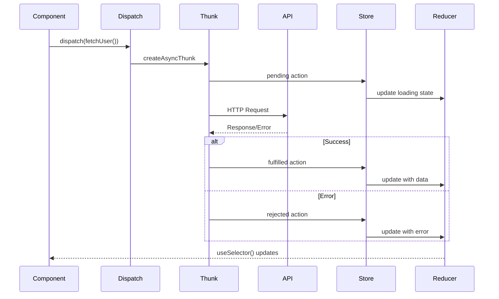

# Redux Toolkit Architecture Documentation

## Overview
This document provides a comprehensive reference for implementing Redux Toolkit in any frontend project. It describes global state management, architectural principles, data flow diagrams, API integration, best practices, and naming conventions to ensure consistency and facilitate future integrations.

---

## Tests

### Reducer Tests

```typescript
// store/redux/__tests__/userSlice.test.ts
import userReducer, { setUser, clearUser } from '../slices/user/userSlice';

describe('user reducer', () => {
  const initialState = {
    currentUser: null,
    isLoading: false,
    error: null,
  };

  it('should handle initial state', () => {
    expect(userReducer(undefined, { type: 'unknown' })).toEqual(initialState);
  });

  it('should handle setUser', () => {
    const user = { id: '1', name: 'John Doe', email: 'john@example.com' };
    const actual = userReducer(initialState, setUser(user));
    expect(actual.currentUser).toEqual(user);
  });

  it('should handle clearUser', () => {
    const stateWithUser = {
      ...initialState,
      currentUser: { id: '1', name: 'John Doe' },
    };
    const actual = userReducer(stateWithUser, clearUser());
    expect(actual.currentUser).toBeNull();
  });
});
```

### Async Thunk Tests

```typescript
// store/redux/__tests__/userThunks.test.ts
import { configureStore } from '@reduxjs/toolkit';
import { fetchUserProfile } from '../slices/user/thunks';
import userReducer from '../slices/user/userSlice';
import { rest } from 'msw';
import { setupServer } from 'msw/node';

const server = setupServer(
  rest.get('/api/users/:id', (req, res, ctx) => {
    return res(ctx.json({ id: req.params.id, name: 'John Doe' }));
  })
);

beforeAll(() => server.listen());
afterEach(() => server.resetHandlers());
afterAll(() => server.close());

describe('user thunks', () => {
  let store;

  beforeEach(() => {
    store = configureStore({
      reducer: { user: userReducer },
    });
  });

  it('should fetch user profile successfully', async () => {
    await store.dispatch(fetchUserProfile('123'));
    
    const state = store.getState();
    expect(state.user.currentUser).toEqual({
      id: '123',
      name: 'John Doe',
    });
    expect(state.user.isLoading).toBe(false);
    expect(state.user.error).toBeNull();
  });

  it('should handle fetch user profile error', async () => {
    server.use(
      rest.get('/api/users/:id', (req, res, ctx) => {
        return res(ctx.status(404), ctx.json({ message: 'User not found' }));
      })
    );

    await store.dispatch(fetchUserProfile('999'));
    
    const state = store.getState();
    expect(state.user.currentUser).toBeNull();
    expect(state.user.isLoading).toBe(false);
    expect(state.user.error).toBe('User not found');
  });
});
```

### Selector Tests

```typescript
// store/redux/__tests__/userSelectors.test.ts
import { selectCurrentUser, selectIsUserLoaded } from '../selectors/userSelectors';

describe('user selectors', () => {
  const mockState = {
    user: {
      currentUser: { id: '1', name: 'John Doe' },
      isLoading: false,
      error: null,
    },
  };

  it('should select current user', () => {
    const result = selectCurrentUser(mockState);
    expect(result).toEqual({ id: '1', name: 'John Doe' });
  });

  it('should select user loaded status', () => {
    const result = selectIsUserLoaded(mockState);
    expect(result).toBe(true);
  });

  it('should memoize selector results', () => {
    const result1 = selectCurrentUser(mockState);
    const result2 = selectCurrentUser(mockState);
    expect(result1).toBe(result2); // Same reference
  });
});
```

### Integration Tests

```typescript
// store/redux/__tests__/userIntegration.test.ts
import { renderHook } from '@testing-library/react-hooks';
import { Provider } from 'react-redux';
import { configureStore } from '@reduxjs/toolkit';
import { useUser } from '../hooks/useUser';

describe('user integration', () => {
  let store;
  let wrapper;

  beforeEach(() => {
    store = configureStore({
      reducer: { user: userReducer },
    });
    wrapper = ({ children }) => (
      <Provider store={store}>{children}</Provider>
    );
  });

  it('should handle user login flow', async () => {
    const { result } = renderHook(() => useUser(), { wrapper });
    
    expect(result.current.isAuthenticated).toBe(false);
    
    await act(async () => {
      await result.current.login({ email: 'john@example.com', password: 'password' });
    });
    
    expect(result.current.isAuthenticated).toBe(true);
    expect(result.current.user).toBeDefined();
  });
});
```

### Test Environment Configuration

```json
// package.json
{
  "scripts": {
    "test": "jest",
    "test:watch": "jest --watch",
    "test:coverage": "jest --coverage"
  },
  "jest": {
    "preset": "ts-jest",
    "testEnvironment": "node",
    "setupFilesAfterEnv": ["<rootDir>/src/setupTests.ts"],
    "moduleNameMapper": {
      "^@/(.*)$": "<rootDir>/src/$1"
    }
  }
}
```

## Development Tools

### Redux DevTools Extension
Redux DevTools is an essential tool for developing and debugging Redux applications.

#### Installation
```bash
# Chrome/Edge Browser
https://chrome.google.com/webstore/detail/redux-devtools/lmhkpmbekcpmknklioeibfkpmmfibljd

# Firefox Browser
https://addons.mozilla.org/en-US/firefox/addon/reduxdevtools/
```

#### Store Configuration
```typescript
// store/redux/store.ts
import { configureStore } from '@reduxjs/toolkit';
import { rootReducer } from './rootReducer';

export const store = configureStore({
  reducer: rootReducer,
  // DevTools are automatically enabled in development
  devTools: process.env.NODE_ENV !== 'production',
  // Advanced DevTools configuration
  enhancers: (getDefaultEnhancers) =>
    getDefaultEnhancers({
      serializableCheck: {
        ignoredActions: ['persist/PERSIST', 'persist/REHYDRATE'],
      },
    }),
});
```

#### Main Features

1. **Time-travel debugging**: Go back in time to see previous state
2. **Inspect state**: View the complete structure of the store
3. **Track actions**: See all dispatched actions with their payload
4. **Diff viewer**: Compare state changes between two actions
5. **Import/Export**: Save and share debugging sessions

#### Advanced Usage
```typescript
// Add context information to actions
const incrementByAmount = createAction<number>(
  'counter/incrementByAmount',
  (amount: number) => ({
    payload: amount,
    meta: {
      timestamp: Date.now(),
      userId: getCurrentUserId(),
    },
  })
);

// Create test actions for debugging
if (process.env.NODE_ENV === 'development') {
  (window as any).debugStore = {
    getState: store.getState,
    dispatch: store.dispatch,
    reset: () => store.dispatch({ type: 'RESET_APP' }),
  };
}
```

### Other Useful Tools

#### Redux Toolkit Query
For automatic cache and API query management:
```typescript
// store/redux/api/apiSlice.ts
import { createApi, fetchBaseQuery } from '@reduxjs/toolkit/query/react';

export const apiSlice = createApi({
  reducerPath: 'api',
  baseQuery: fetchBaseQuery({
    baseUrl: '/api',
    prepareHeaders: (headers, { getState }) => {
      const token = (getState() as RootState).auth.token;
      if (token) {
        headers.set('authorization', `Bearer ${token}`);
      }
      return headers;
    },
  }),
  tagTypes: ['Post', 'User'],
  endpoints: (builder) => ({
    getPosts: builder.query<Post[], void>({
      query: () => '/posts',
      providesTags: ['Post'],
    }),
    getPost: builder.query<Post, string>({
      query: (id) => `/posts/${id}`,
      providesTags: (result, error, id) => [{ type: 'Post', id }],
    }),
  }),
});
```

#### Custom Logger Middleware
```typescript
// store/redux/middleware/loggerMiddleware.ts
export const loggerMiddleware = (store) => (next) => (action) => {
  console.group(action.type);
  console.info('dispatching', action);
  const result = next(action);
  console.log('next state', store.getState());
  console.groupEnd();
  return result;
};
```

## Performance Optimization

### 1. Using Reselect for Memoized Selectors

```typescript
// store/redux/selectors/userSelectors.ts
import { createSelector } from '@reduxjs/toolkit';
import { RootState } from '../store';

// Base selector
const selectUserState = (state: RootState) => state.user;

// Memoized selectors
export const selectCurrentUser = createSelector(
  [selectUserState],
  (userState) => userState.currentUser
);

export const selectUserLoading = createSelector(
  [selectUserState],
  (userState) => userState.isLoading
);

// Complex selector with multiple dependencies
export const selectActiveUsers = createSelector(
  [(state: RootState) => state.users.items, (state: RootState) => state.users.filter],
  (users, filter) => users.filter(user => user.isActive && user.name.includes(filter))
);

// Selector with parameters
export const selectUserById = (userId: string) => createSelector(
  [selectUserState],
  (userState) => userState.users[userId]
);
```

### 2. Data Normalization

```typescript
// Normalized vs Denormalized Structure

// ❌ Bad - Denormalized Structure
interface BadState {
  posts: Array<{
    id: string;
    title: string;
    author: {
      id: string;
      name: string;
      email: string;
    };
    comments: Array<{
      id: string;
      text: string;
      author: {
        id: string;
        name: string;
      };
    }>;
  }>;
}

// ✅ Good - Normalized Structure
interface GoodState {
  posts: {
    ids: string[];
    entities: Record<string, {
      id: string;
      title: string;
      authorId: string;
    }>;
  };
  users: {
    ids: string[];
    entities: Record<string, {
      id: string;
      name: string;
      email: string;
    }>;
  };
  comments: {
    ids: string[];
    entities: Record<string, {
      id: string;
      text: string;
      postId: string;
      authorId: string;
    }>;
  };
}
```

### 3. Avoiding Unnecessary Re-renders

```typescript
// Optimized component with React.memo and useSelector
import React, { memo } from 'react';
import { useSelector, shallowEqual } from 'react-redux';
import { selectUserLoading, selectCurrentUser } from '../selectors/userSelectors';

const UserProfile = memo(({ userId }: { userId: string }) => {
  // Use shallowEqual to compare objects
  const user = useSelector(selectCurrentUser, shallowEqual);
  const isLoading = useSelector(selectUserLoading);
  
  // Inline selector with parameter
  const userPosts = useSelector((state: RootState) => 
    state.posts.entities.filter(post => post.authorId === userId)
  );
  
  if (isLoading) return <LoadingSpinner />;
  if (!user) return <NotFound />;
  
  return (
    <div>
      <h1>{user.name}</h1>
      <UserPosts posts={userPosts} />
    </div>
  );
});

// Callback optimization
const UserList = () => {
  const users = useSelector(selectUsers);
  const dispatch = useDispatch();
  
  // useCallback to avoid function recreation
  const handleUserClick = useCallback((userId: string) => {
    dispatch(selectUser(userId));
  }, [dispatch]);
  
  return (
    <div>
      {users.map(user => (
        <UserCard 
          key={user.id} 
          user={user} 
          onClick={handleUserClick}
        />
      ))}
    </div>
  );
};
```

### 4. Performance Best Practices

- **Use memoized selectors** for expensive calculations
- **Normalize data** to avoid duplication
- **Limit useSelector usage** in child components
- **Use shallowEqual** for object comparison
- **Avoid complex inline selectors** in components
- **Implement pagination** for large lists
- **Use RTK Query** for automatic data caching

## Table of Contents
1. [Why Redux Toolkit?](#why-redux-toolkit)
2. [Global State Management Structure](#global-state-management-structure)
3. [Redux Toolkit Fundamentals](#redux-toolkit-fundamentals)
4. [Architecture Diagrams](#architecture-diagrams)
5. [API Integration Examples](#api-integration-examples)
6. [Error Handling](#error-handling)
7. [State Management Best Practices](#state-management-best-practices)
8. [Performance Optimization](#performance-optimization)
9. [Development Tools](#development-tools)
10. [Tests](#tests)
11. [Naming Conventions & Code Organization](#naming-conventions--code-organization)
12. [Language Considerations](#language-considerations)

---

## Why Redux Toolkit?

Redux Toolkit (RTK) was chosen as the state management solution for this project for several fundamental reasons:

### Redux Toolkit Advantages
- **Boilerplate reduction**: RTK eliminates most of the repetitive code associated with vanilla Redux through `createSlice` and `createAsyncThunk`
- **Best practices integration**: Optimized store configuration, Immer for immutability, DevTools enabled by default
- **Asynchronous logic simplification**: `createAsyncThunk` automatically generates pending/fulfilled/rejected actions
- **Native TypeScript support**: Excellent type support with robust automatic inference
- **Mature ecosystem**: Large community, numerous resources and extensions available

### Why Not Other Solutions?
- **Context API**: Lacks advanced features like middleware, DevTools, complex state management
- **Zustand**: While simpler, less suitable for complex applications with many interactions
- **MobX**: Different observation-based approach, less explicit in data flow

### When to Use Redux Toolkit?
RTK is particularly suitable when:
- The application has complex and shared global state
- Multiple unconnected components need to access the same data
- Business logic is complex with asynchronous states
- The team benefits from a predictable and debuggable architecture

---

## Global State Management Structure

### Store Configuration
- **Recommended file:** `store/redux/store.ts`
- Combines reducers from business slices (e.g., `user`, `ui`, `settings`, etc.).
- Uses `redux-persist` with `localForage` for persistence (IndexedDB as fallback).
- Option to add custom transforms for serializing/deserializing certain data types.
- Typical middleware: logger, error handling, persistence cleanup.

### Slices
- Each slice manages a business domain (e.g., authentication, user interface, business entities, etc.).
- Recommended structure:
  - **State**: local domain state
  - **Actions**: local changes
  - **Thunks**: asynchronous operations (API, side effects)
  - **ExtraReducers**: API response and error handling

### Actions & Thunks
- Slices expose actions for local changes.
- Thunks handle asynchronous logic (API calls, session refresh, etc.).
- ExtraReducers allow handling thunk responses and errors.

### Selectors
- Centralize selectors in `store/redux/selectors/` or in each slice.
- Selectors allow accessing state fragments for components and hooks.

### Middleware
- **Logger**: logs actions and state changes for debugging.
- **Error**: handles rejected actions and error reporting.
- **Persistence cleanup**: purges persisted slices during logout or sensitive events.

---

## Redux Toolkit Fundamentals
- **Immutability**: state is never modified directly; reducers return a new state object.
- **Single source of truth**: all global state is managed in the Redux store.
- **Predictable transitions**: actions and reducers explicitly define state transitions.
- **Asynchronous logic**: thunks encapsulate side effects and API calls.
- **Persistence**: critical slices can be persisted with `redux-persist` and `localForage`.

---

## Architecture Diagrams

### Detailed Data Flow Diagram

```mermaid
graph TD
    A[React Component] -->|useDispatch()| B[Action/Thunk]
    B -->|Action synchrone| C[Middleware]
    B -->|Thunk asynchrone| D[createAsyncThunk]
    D -->|API Call| E[Backend API]
    D -->|Pending| C
    E -->|Success| F[Dispatch fulfilled]
    E -->|Error| G[Dispatch rejected]
    F --> C
    G --> C
    C -->|Next| H[Reducer]
    H -->|New State| I[Store]
    I -->|useSelector()| J[React Component]
    J -->|Re-render| A
    
    style A fill:#e1f5fe
    style I fill:#fff3e0
    style E fill:#f3e5f5
```

### Async Action Lifecycle



---

## API Integration Examples

### Thunk Examples
```typescript
// store/redux/slices/{domain}/thunks/index.ts
export { actionA, actionB } from './domainThunks';
export { logoutThunk, refreshSession } from './sessionThunks';
```
- Thunks dispatch asynchronous API calls and update state via extraReducers.

### CRUD Example
```typescript
// store/redux/slices/{domain}/extraReducers.ts
builder
  .addCase(fetchEntities.pending, (state) => { state.isLoading = true; })
  .addCase(fetchEntities.fulfilled, (state, action) => { state.items = action.payload.items; state.isLoading = false; })
  .addCase(fetchEntities.rejected, (state, action) => { state.error = action.error; state.isLoading = false; });
```

---

## Error Handling

### Multi-level Strategy

#### 1. In Thunks (createAsyncThunk)
```typescript
// store/redux/slices/user/thunks.ts
export const fetchUserProfile = createAsyncThunk(
  'user/fetchProfile',
  async (userId: string, { rejectWithValue }) => {
    try {
      const response = await api.get(`/users/${userId}`);
      return response.data;
    } catch (error) {
      // Specific error handling
      if (error.response?.status === 404) {
        return rejectWithValue('User not found');
      }
      return rejectWithValue(error.message || 'Failed to fetch user');
    }
  }
);
```

#### 2. Global Error Middleware
```typescript
// store/redux/middleware/errorMiddleware.ts
import { isRejectedWithValue } from '@reduxjs/toolkit';
import { toast } from 'react-toastify';

export const errorMiddleware = (api) => (next) => (action) => {
  if (isRejectedWithValue(action)) {
    // Log the error
    console.error('API Error:', action.payload);
    
    // User notification
    toast.error(action.payload || 'An error occurred');
    
    // Reporting (ex: Sentry)
    // Sentry.captureException(action.error);
  }
  
  return next(action);
};
```

#### 3. Error State Management in Slices
```typescript
// store/redux/slices/user/userSlice.ts
interface UserState {
  data: User | null;
  isLoading: boolean;
  error: string | null;
  validationErrors: Record<string, string>;
}

const initialState: UserState = {
  data: null,
  isLoading: false,
  error: null,
  validationErrors: {}
};

const userSlice = createSlice({
  name: 'user',
  initialState,
  reducers: {
    clearError: (state) => {
      state.error = null;
    },
    clearValidationErrors: (state) => {
      state.validationErrors = {};
    }
  },
  extraReducers: (builder) => {
    builder
      .addCase(fetchUserProfile.rejected, (state, action) => {
        state.isLoading = false;
        state.error = action.payload as string;
      })
      .addCase(updateUserProfile.rejected, (state, action) => {
        if (action.payload?.validationErrors) {
          state.validationErrors = action.payload.validationErrors;
        } else {
          state.error = action.payload as string;
        }
      });
  }
});
```

### Types of Errors to Handle
- **Network errors**: Timeout, lost connection
- **HTTP errors**: 4xx (client), 5xx (server)
- **Validation errors**: Invalid fields, business constraints
- **Authentication errors**: Expired token, access denied
- **Parsing errors**: Malformatted data

---

## State Management Best Practices
- **Keep slices focused**: each slice should handle a single business domain.
- **Use selectors**: centralize state access logic for maintainability and testing.
- **Normalize data**: store entities as objects/maps for efficient updates.
- **Handle errors globally**: use error middleware and error states at the slice level.
- **Purge sensitive data**: clean persistent state during logout or critical events.
- **Test reducers and thunks**: add unit tests in `store/redux/__tests__/`.

### Addressing Redux Criticisms
While Redux has been criticized for its perceived complexity and boilerplate, Redux Toolkit addresses these issues:

- **Excessive boilerplate**: RTK drastically reduces the code needed with `createSlice`
- **Steep learning curve**: RTK's simplified API is more accessible to beginner developers
- **Over-engineering**: With RTK, Redux is no longer "too complex" for simple applications
- **Verbosity**: RTK code is concise and expressive

Organization by features (feature slices) and judicious use of local vs global state help avoid over-engineering.

---

## Naming Conventions & Code Organization
- **Slices**: `store/redux/slices/{domain}/{domain}Slice.ts`
- **Reducers**: `reducers.ts` in each slice folder.
- **Thunks**: `thunks.ts` or modularized in `thunks/` subfolders.
- **Selectors**: `selectors/{domain}Selectors.ts` or in slice folders.
- **Types**: `types.ts` in each slice folder.
- **Middleware**: `middleware/{name}Middleware.ts`
- **Hooks**: `hooks.ts` for typed Redux hooks (`useAppDispatch`, `useAppSelector`).
- **Exports**: centralize in `store/redux/index.ts` for simplified imports.

### Recommended Feature-Based Organization

```
store/
└── redux/
    ├── slices/
    │   ├── auth/
    │   │   ├── authSlice.ts
    │   │   ├── authThunks.ts
    │   │   ├── authSelectors.ts
    │   │   └── types.ts
    │   ├── user/
    │   │   ├── userSlice.ts
    │   │   ├── userThunks.ts
    │   │   ├── userSelectors.ts
    │   │   └── types.ts
    │   └── posts/
    │       ├── postsSlice.ts
    │       ├── postsThunks.ts
    │       ├── postsSelectors.ts
    │       └── types.ts
    ├── middleware/
    │   ├── errorMiddleware.ts
    │   ├── loggerMiddleware.ts
    │   └── authMiddleware.ts
    ├── selectors/
    │   └── rootSelectors.ts
    ├── hooks/
    │   └── reduxHooks.ts
    ├── store.ts
    └── index.ts
```

---

## Language Considerations

### English Version
This document is written in English to facilitate understanding for the international development team.

### Code Standards
- Use English variable and function names in code
- Comment code in English to facilitate international collaboration
- Maintain consistent naming conventions across the codebase

### Recommendations for Contributors
- Use English for all documentation and code comments
- Follow established naming conventions
- Add comprehensive documentation for complex logic
- Consider multilingual teams when writing technical documentation

---

---

## Quick Start for Contributors
1. **Add a new slice**: use `createSlice` in a new folder under `slices/`.
2. **Define actions and reducers**: keep them focused and descriptive.
3. **Add thunks for async logic**: place them in `thunks/` and link them in extraReducers.
4. **Create selectors**: expose state fragments for components.
5. **Register the slice in `store.ts`**: add it to the root reducer and configure persistence if necessary.
6. **Test your logic**: add unit tests in `__tests__/`.

---

## References
- [Redux Toolkit Documentation](https://redux-toolkit.js.org/)
- [Redux Persist Documentation](https://github.com/rt2zz/redux-persist)
- [localForage Documentation](https://localforage.github.io/localForage/)
- [Reselect Documentation](https://github.com/reduxjs/reselect)
- [Redux DevTools Extension](https://github.com/reduxjs/redux-devtools)
- [RTK Query Documentation](https://redux-toolkit.js.org/rtk-query/overview)
- [Testing Redux](https://redux.js.org/usage/writing-tests)
- [Redux Toolkit TypeScript Guide](https://redux-toolkit.js.org/usage/usage-with-typescript)

---

For any questions, adapt this template to your business domain and consult the official documentation or open an issue in your repository.