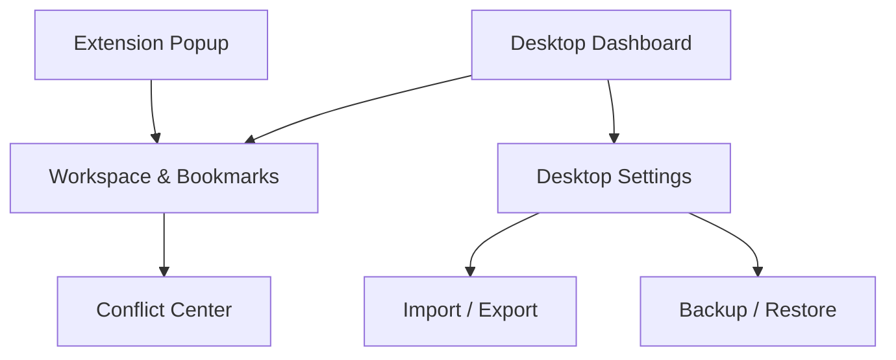

## 1. Product Overview

SyncMark synchronizes browser bookmarks across devices/browsers using a local desktop app and a Chrome extension.
It adds multi-workspace switching, conflict resolution with version history, and import/export + backup/restore.

## 2. Core Features

### 2.1 User Roles

| Role       | Registration Method    | Core Permissions                                                                 |
| ---------- | ---------------------- | -------------------------------------------------------------------------------- |
| Local User | No account (local app) | Create/switch workspaces, sync, resolve conflicts, import/export, backup/restore |

### 2.2 Feature Module

Our requirements consist of the following main pages:

1. **Desktop Dashboard**: connection status, active workspace, recent sync activity, quick actions.
2. **Workspace & Bookmarks**: workspace list + switch, bookmark tree view, sync status per workspace, conflict center.
3. **Desktop Settings**: storage location, sync behavior, import/export, backup/restore.
4. **Extension Popup**: connection indicator, current workspace, switch workspace, last sync / errors.

### 2.3 Page Details

| Page Name             | Module Name            | Feature description                                                                                                                 |
| --------------------- | ---------------------- | ----------------------------------------------------------------------------------------------------------------------------------- |
| Desktop Dashboard     | App shell & navigation | Show left navigation (Dashboard / Workspace & Bookmarks / Settings) and header with active workspace + connection state             |
| Desktop Dashboard     | Connection & identity  | Display WebSocket status, extension identity (browser name), and reconnection guidance                                              |
| Desktop Dashboard     | Sync overview          | Show last sync time, counts (created/updated/removed), and current operation state (idle/syncing)                                   |
| Desktop Dashboard     | Quick actions          | Trigger “Sync now”, open Conflict Center, open Backup/Restore                                                                       |
| Workspace & Bookmarks | Workspace management   | List workspaces, create/rename/delete, set active workspace, show per-workspace last sync + health                                  |
| Workspace & Bookmarks | Workspace switching    | Switch active workspace and propagate change to extension; block switch while syncing unless user confirms                          |
| Workspace & Bookmarks | Bookmark browser       | Browse bookmarks as a tree, search within current workspace, show item metadata (title/url/path/updated)                            |
| Workspace & Bookmarks | Realtime sync status   | Show incoming/outgoing events and per-item change indicators (created/updated/removed)                                              |
| Workspace & Bookmarks | Conflict Center        | List conflicts, compare “Local (desktop)” vs “Browser” versions, choose resolution action; keep a version entry for each resolution |
| Workspace & Bookmarks | Version history        | View prior versions of a bookmark (title/url/path/timestamps/source) and restore a selected version                                 |
| Desktop Settings      | Storage & safety       | Configure local storage location and retention (max versions per item, tombstone retention)                                         |
| Desktop Settings      | Sync behavior          | Configure default conflict policy (ask / last-write-wins / prefer-desktop / prefer-browser) and ping/health options                 |
| Desktop Settings      | Import / Export        | Import bookmarks into a chosen workspace; export a workspace to a file; choose merge vs replace on import                           |
| Desktop Settings      | Backup / Restore       | Create full backup (all workspaces + config), restore from backup with preview and safety confirmation                              |
| Extension Popup       | Connection indicator   | Show WebSocket connection status and fallback state (desktop closed)                                                                |
| Extension Popup       | Workspace selector     | Display active workspace and allow switching; confirm if a sync is running                                                          |
| Extension Popup       | Sync feedback          | Show last sync time/result and latest error message (if any)                                                                        |

## 3. Core Process

**Initial setup flow (Local User)**

1. Install and run the desktop app.
2. Install the Chrome extension.
3. Extension connects to `ws://localhost:9876` and sends identify.
4. Desktop confirms connection and requests/initiates initial sync for the active workspace.

**Daily usage flow**

1. You choose a workspace (desktop or extension).
2. Bookmark changes in the browser are streamed to desktop (create/update/remove/move).
3. Desktop persists changes to the active workspace store and broadcasts “bookmarks\_updated”.
4. If a conflict is detected, desktop records both versions and surfaces it in Conflict Center.

**Conflict resolution & versioning flow**

1. A conflict appears when the same bookmark logical identity diverges between desktop store and browser changes.
2. Desktop stores a new version entry (no data loss) and marks the bookmark as “conflicted”.
3. You resolve by choosing desktop version, browser version, or restoring a prior version.

**Import/Export + Backup/Restore flow**

1. Export: choose workspace → generate export file.
2. Import: choose workspace + merge/replace → apply changes → run a sync.
3. Backup: create full snapshot; Restore: preview → restore → resync.

