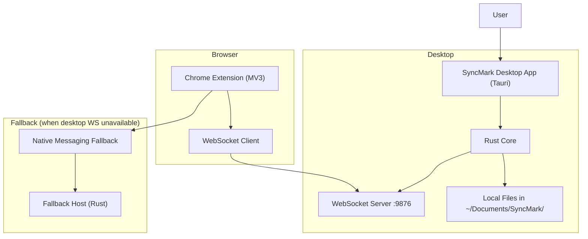

## 1.Architecture design

## 2.Technology Description
- Frontend: React@18 + TypeScript + Vite (desktop UI)
- Desktop runtime: Tauri 2.x
- Desktop backend: Rust + tokio + tokio-tungstenite + serde_json + notify + parking_lot
- Browser extension: Chrome Extension Manifest V3 (service worker background) + popup UI
- Backend: None (local-first; sync server is embedded in desktop app)

## 3.Route definitions
| Route | Purpose |
|-------|---------|
| / | Desktop Dashboard (status + quick actions) |
| /workspaces | Workspace list, switching, bookmarks tree, conflicts |
| /settings | Storage, sync policies, import/export, backup/restore |

## 4.API definitions (If it includes backend services)
Not applicable (no external backend). The system uses an internal WebSocket protocol between extension and desktop.

## 6.Data model(if applicable)
### 6.1 Data model definition
Local-first JSON models persisted under `~/Documents/SyncMark/`.

**Workspace**
- `id: string`
- `name: string`
- `created_at: string`
- `updated_at: string`

**BookmarkItem** (tree)
- `id: string` (browser id + workspace namespace)
- `parent_id: string | null`
- `type: "folder" | "bookmark"`
- `title: string`
- `url?: string`
- `index: number`
- `updated_at: string`
- `deleted_at?: string` (tombstone)
- `version: number` (monotonic per item)
- `last_source: "desktop" | "browser"`
- `conflict?: { status: "open" | "resolved"; conflict_id: string }`

**BookmarkVersion** (history)
- `conflict_id?: string`
- `bookmark_id: string`
- `version: number`
- `snapshot: { title, url, parent_id, index }`
- `source: "desktop" | "browser"`
- `created_at: string`

### 6.2 Conflict resolution policy (runtime)
- Detect conflict when an incoming change targets an item whose `version` is different than expected, or when two updates arrive for the same logical identity with different field values.
- Record both snapshots as versions; mark item as conflicted.
- Default strategies (configurable):
  - Ask (surface in Conflict Center)
  - Last-write-wins (by `updated_at`)
  - Prefer-desktop / Prefer-browser

### 6.3 WebSocket message alignment
Keep current message shapes and extend payloads minimally:
- Add `workspace_id` to all bookmark change payloads.
- Add `version` + `updated_at` to bookmark item payloads.
- Add conflict notifications: `{ type: "conflict_detected", payload: { workspace_id, bookmark_id, conflict_id } }`.